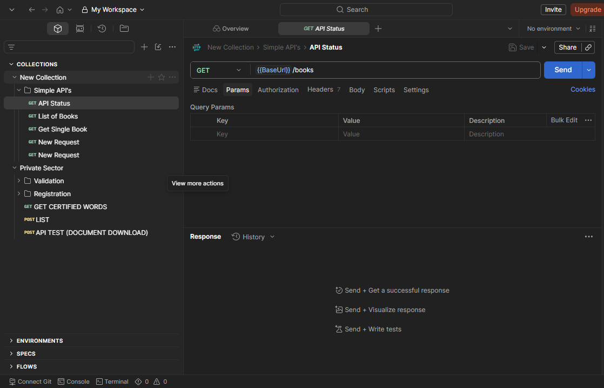

# 🔌 API Testing & Validation

> Designing and executing reliable API testing strategies to ensure backend services are secure, performant, and function correctly before reaching end users.

---

## Project Overview

Modern web and mobile applications rely heavily on APIs. Throughout my QA career, I have designed and executed API testing strategies that validate backend functionality independently of the user interface.

My approach focuses on ensuring APIs are reliable, secure, well-documented, and capable of supporting production workloads.

---

## Objectives

- Validate API functionality
- Verify request and response structures
- Ensure proper authentication and authorization
- Detect backend defects before UI testing
- Improve regression confidence
- Support continuous delivery pipelines

---

## Technologies

| Tool | Purpose |
|------|---------|
| Postman | Manual API Testing |
| Swagger / OpenAPI | API Documentation |
| SQL | Backend Data Validation |
| REST APIs | Functional Testing |
| JSON | Request & Response Validation |
| JavaScript | Postman Test Scripts |
| Git | Version Control |

---

## API Testing Coverage

### Authentication

- Login
- Logout
- JWT Tokens
- Bearer Tokens
- API Keys
- Session Validation

---

### Functional Validation

- CRUD Operations
- Resource Creation
- Resource Updates
- Resource Deletion
- Search APIs
- Filtering
- Sorting
- Pagination

---

### Response Validation

- Status Codes
- Response Time
- Response Body
- JSON Schema
- Error Messages
- Required Fields
- Optional Fields

---

### Backend Validation

- SQL Database Verification
- Data Integrity
- Record Creation
- Record Updates
- Transaction Validation

---

## Sample Validation Checklist

✅ Status Code Validation

✅ Response Time

✅ Response Schema

✅ Required Fields

✅ Business Rules

✅ Error Handling

✅ Authorization

✅ Authentication

✅ SQL Validation

---

## Example Workflow

```text
Client Request
        │
        ▼
REST API
        │
        ▼
Authentication
        │
        ▼
Business Logic
        │
        ▼
Database Validation
        │
        ▼
Response Verification
```

---

## Engineering Practices

My API testing process includes:

- Early API validation before UI testing
- Reusable Postman Collections
- Environment Variables
- Collection Variables
- Automated Assertions
- Negative Testing
- Boundary Testing
- Regression Testing

---

## Business Impact

API testing provides several advantages:

- Detects backend issues early
- Reduces UI testing failures
- Improves release confidence
- Speeds up regression testing
- Ensures data integrity
- Supports scalable automation

---

## Skills Demonstrated

- REST API Testing
- Postman
- Swagger / OpenAPI
- SQL Validation
- JSON Parsing
- Authentication Testing
- Regression Testing
- Backend Verification
- Fintech API Testing

---

## Sample API Collection

{ loading=lazy }

---

## Lessons Learned

Working with APIs has reinforced the importance of validating backend services independently of the user interface. Early API testing reduces downstream defects, accelerates debugging, and improves the overall quality of software releases by identifying issues before they surface in the frontend.