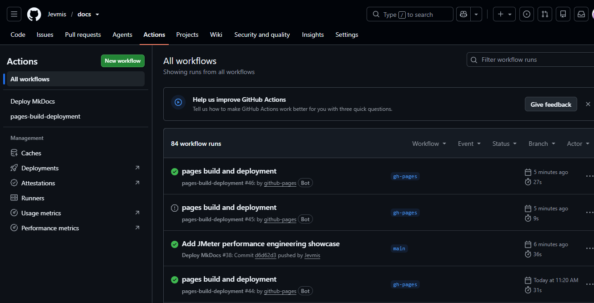

# 🚀 CI/CD for Quality Engineering

> Integrating quality assurance into Continuous Integration and Continuous Delivery pipelines to enable faster, safer, and more reliable software releases.

---

## Overview

Modern Quality Assurance goes beyond writing automated tests. It involves integrating quality checks directly into the software delivery pipeline so defects are detected early and releases remain reliable.

I design automation frameworks with CI/CD in mind, enabling automated UI, API, and regression testing to run consistently on every code change. This approach provides rapid feedback to development teams, reduces release risk, and supports continuous delivery.

---

## Real-world CI/CD Activities

  Throughout my projects, I have:

  1. Configured GitHub Actions workflows for automated testing
  2. Executed Cypress and Playwright test suites in CI environments
  3. Generated HTML test reports as pipeline artifacts
  4. Used environment variables for secure configuration
  5. Designed automation frameworks to run reliably in headless environments
  6. Integrated regression testing into release workflows

  ---

## CI/CD Workflow

```text
Developer Pushes Code
          │
          ▼
Version Control (Git)
          │
          ▼
CI Pipeline Triggered
          │
          ▼
Install Dependencies
          │
          ▼
Run Automated Tests
          │
          ▼
Generate Reports
          │
          ▼
Publish Results
          │
          ▼
Deployment Approval
          │
          ▼
Production
```

---

## Technologies

| Tool | Purpose |
|------|---------|
| Git | Version Control |
| GitHub | Source Repository |
| GitHub Actions | CI Automation |
| Docker | Environment Consistency |
| Cypress | UI & API Automation |
| Playwright | Cross-browser Automation |
| Apache JMeter | Performance Testing |
| Mochawesome | Cypress reporting |
| Playwright HTML Reports | Test reporting |

---

## Typical Pipeline Stages

- Checkout Repository
- Install Project Dependencies
- Configure Environment Variables
- Execute Automated Test Suites
- Generate HTML Reports
- Upload Test Artifacts
- Publish Results
- Notify Engineering Team
- Approve Deployment

---

## Example GitHub Actions Workflow

```yaml
name: QA Pipeline

on:
  push:
  pull_request:

jobs:
  test:
    runs-on: ubuntu-latest

    steps:

      - uses: actions/checkout@v4

      - uses: actions/setup-node@v4

      - run: npm install

      - run: npx cypress run
```

---

## Sample Reports

- Pipeline Artifacts
- GitHub Actions Workflow
- Cypress HTML Report
- Playwright HTML Report
- Test Execution Logs
- Screenshots
- Videos

- 

---

## Benefits

- Faster feedback
- Early defect detection
- Automated regression testing
- Consistent deployments
- Improved release confidence
- Reduced manual effort

---

## Business Impact

Integrating automated testing into CI/CD pipelines helped:

- Detect defects earlier in the development lifecycle
- Reduce manual regression effort
- Increase deployment confidence
- Provide rapid feedback to developers
- Improve release consistency
- Support faster software delivery

---

## Lessons Learned

Building CI/CD-ready automation reinforced several important engineering principles:

- Automation should be deterministic and repeatable.
- Tests must be reliable before they can be trusted in a pipeline.
- Fast feedback is more valuable than running every test on every commit.
- Clear reporting helps developers resolve failures quickly.

---

## Skills Demonstrated

- Git
- GitHub
- GitHub Actions
- Continuous Integration
- Continuous Delivery
- Automated Testing
- Pipeline Design

---

## Future Enhancements

Looking Ahead

As I continue growing in Quality Engineering, I plan to further strengthen my CI/CD capabilities by integrating:

- Performance testing with Apache JMeter
- Security testing with OWASP ZAP
- Parallel test execution
- Cloud-based test environments
- Automated quality gates
- AI-assisted test analysis