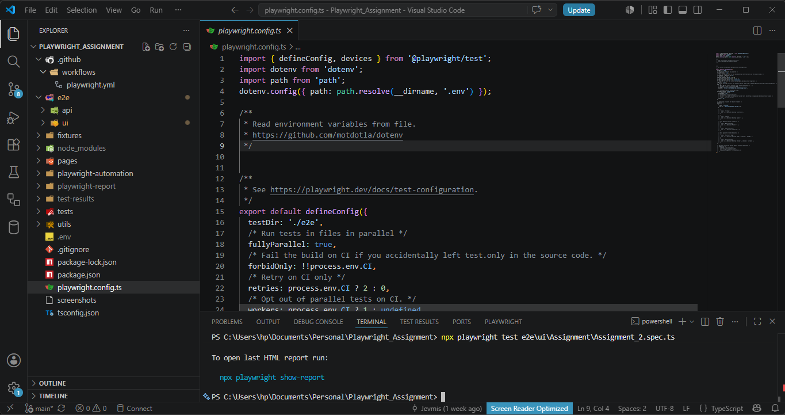
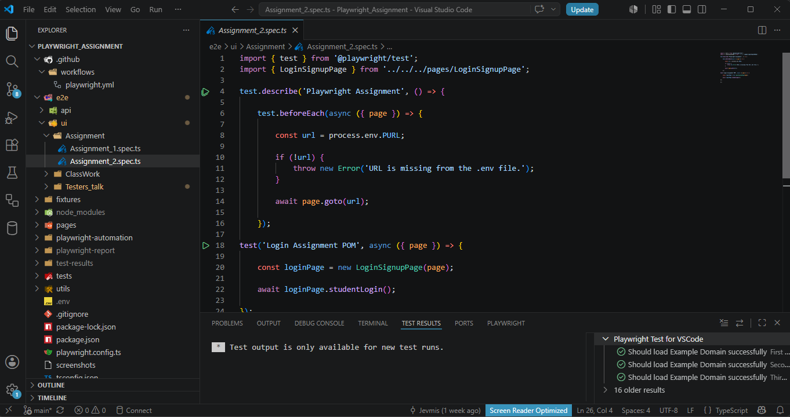

# 🎭 Playwright Automation Framework

> A modern end-to-end automation framework built with Playwright, focusing on cross-browser testing, maintainable architecture, and scalable test automation.

---

# Overview

As I expanded my automation expertise beyond Cypress, I began exploring Playwright to better understand modern browser automation and cross-browser testing.

Rather than simply learning a new tool, I focused on understanding the engineering principles behind building reliable automation frameworks that remain maintainable as applications evolve.

My Playwright framework reflects that journey, applying clean architecture, reusable components, and software engineering best practices to automated testing.

---

# Framework Highlights

## Architecture

The framework is built around modern automation engineering principles, including:

- Page Object Model (POM)
- Reusable Page Classes
- Test Fixtures
- Locator Strategies
- TypeScript
- Cross-browser Testing
- Screenshots & Traces
- HTML Reporting
- Modular Project Structure

---

## Technologies Used

- Playwright
- TypeScript
- Node.js
- Playwright Test Runner
- HTML Reports
- VS Code

---

# Framework Structure

The project follows a modular architecture designed for scalability and maintainability.

Typical components include:

- Page Objects
- Test Files
- Fixtures
- Utilities
- Configuration
- Test Data
- Reports

---

## Project Structure

{ loading=lazy }

---

# Applying the Page Object Model

One of the most valuable lessons while learning Playwright was understanding the importance of the Page Object Model (POM).

At first, creating separate page classes seemed unnecessary.

Why create another file when all the interactions could live inside a single test?

The answer became clear as projects grew.

Instead of scattering selectors throughout multiple test files, page interactions become reusable methods.

For example, rather than repeatedly writing:

```ts
await page.getByLabel('Username').fill(username);

await page.getByLabel('Password').fill(password);

await page.getByRole('button', { name: 'Submit' }).click();
```

the test simply becomes:

```ts
await loginPage.login(username, password);
```

This improves readability, reduces duplication, and makes UI changes much easier to maintain.

---

## Page Object Example

{ loading=lazy }

---

[:fontawesome-brands-linkedin: Read the full engineering article](https://www.linkedin.com/posts/michaeljndueso_playwright-testautomation-softwaretesting-activity-7481401573907193856-ocLB?utm_source=social_share_send&utm_medium=member_desktop_web&rcm=ACoAAC0KOAMB4JNjVL1I3Cfum1yHcU8dfCVfy80){ .md-button .md-button--primary }

---

# Locator Strategies

Playwright provides several powerful locator strategies, allowing tests to closely mimic real user interactions.

Examples include:

- getByRole()
- getByLabel()
- getByPlaceholder()
- getByText()
- CSS Selectors
- XPath

Using semantic locators improves test reliability and resilience against UI changes.

---

# Cross-Browser Testing

One of Playwright's greatest strengths is its native support for multiple browser engines.

The framework supports testing across:

- Chromium
- Firefox
- WebKit

This enables early detection of browser-specific issues without requiring additional tooling.

---

# Reporting & Debugging

Playwright includes powerful debugging capabilities that simplify investigation when tests fail.

Features include:

- HTML Reports
- Trace Viewer
- Screenshots
- Video Recording
- Step-by-step Execution
- Network Inspection

These tools provide valuable insights into test execution and significantly reduce debugging time.

---

# Lessons Learned

Learning Playwright reinforced an important principle:

Automation is not just about executing tests—it is about designing software.

Good automation frameworks apply the same engineering principles used in application development:

- Separation of concerns
- Reusability
- Readability
- Maintainability
- Scalability

Understanding these concepts has helped me build automation that is easier to extend and maintain over time.

---

# Skills Demonstrated

- Playwright
- TypeScript
- Page Object Model
- Cross-browser Testing
- Test Automation
- HTML Reports
- Locator Strategies
- Automation Framework Design
- Software Engineering Principles

---

> **"A good automation framework doesn't just execute tests, it makes future maintenance easier."**