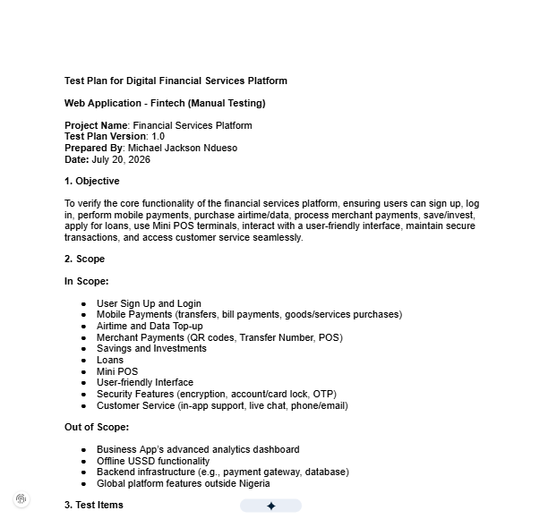

# 📑 QA Documentation

> Comprehensive Quality Assurance documentation designed to standardize testing processes, improve collaboration, and support high-quality software delivery.

---

# Overview

Quality Assurance extends far beyond executing test cases.

Throughout my career, I've developed structured documentation that helps teams plan, execute, monitor, and continuously improve software quality.

From test strategies and release documentation to onboarding guides and engineering knowledge bases, these artifacts establish consistent processes, improve collaboration, and support reliable software delivery.

Rather than treating documentation as an afterthought, I consider it a core engineering asset that enables teams to scale effectively.

---

# Technologies & Platforms

Documentation developed using:

- MkDocs Material
- Wiki.js
- Markdown
- Microsoft Word
- Google Docs
- Microsoft Excel
- Jira

---

# Documentation Philosophy

Good documentation should be:

- Clear
- Practical
- Reusable
- Easy to maintain
- Easy to understand
- Accessible to both technical and non-technical stakeholders

Good documentation serves as a shared source of truth, enabling engineering teams to work consistently, onboard faster, and deliver software with greater confidence.

---

## Quality Planning

- Test Strategies
- Test Plans
- Test Cases

## Process Documentation

- QA Workflows
- Standard Operating Procedures (SOPs)
- QA Onboarding Guides

## Release Documentation

- Release Checklists
- UAT Plans
- Release Documentation

## Knowledge Management

- Engineering Knowledge Bases
- Requirement Validation Documents
- Bug Reporting Guidelines

---

# Sample Documentation

{ loading=lazy }

---

# Documentation Workflow

Every document follows a structured lifecycle to ensure consistency.

```text
Requirements
        │
        ▼
Test Strategy
        │
        ▼
Test Planning
        │
        ▼
Test Design
        │
        ▼
Test Execution
        │
        ▼
Bug Reporting
        │
        ▼
Regression Testing
        │
        ▼
Release Validation
        │
        ▼
Knowledge Capture
```

---

# Examples of Documentation Produced

## 📋 Test Strategy

Defines:

- Testing scope
- Objectives
- Risks
- Test approach
- Entry criteria
- Exit criteria

---

## 📑 Test Plans

Includes:

- Features under test
- Testing schedule
- Resource allocation
- Deliverables
- Risks
- Dependencies

---

## 🧪 Test Cases

Structured test cases containing:

- Preconditions
- Test steps
- Expected results
- Test data
- Postconditions

---

## 🐞 Bug Reporting Standards

Every defect report includes:

- Summary
- Environment
- Severity
- Priority
- Reproduction steps
- Expected result
- Actual result
- Screenshots
- Logs
- Recommendations

---

## 🚀 Release Documentation

Prepared release documents covering:

- Smoke Testing
- Regression Results
- Known Issues
- Risk Assessment
- Deployment Validation
- UAT Sign-off
- Release Readiness

---

## 📚 Knowledge Base

Created centralized engineering documentation containing:

- QA Standards
- Team Procedures
- Testing Guidelines
- Reusable Templates
- Troubleshooting Guides
- Onboarding Resources

---

# Benefits Delivered

Well-structured QA documentation has helped teams:

- Standardized QA processes
- Improved testing consistency
- Reduced onboarding time
- Improved collaboration across cross-functional teams
- Reduced knowledge loss
- Increased release confidence
- Simplified long-term maintenance

---

# Engineering Impact

These documentation systems helped engineering teams by:

- Establishing consistent QA standards
- Improving communication across teams
- Accelerating onboarding for new engineers
- Supporting repeatable testing processes
- Increasing release readiness through structured validation
- Preserving institutional knowledge

---

# Skills Demonstrated

### Quality Engineering

- Test Planning
- Test Strategy
- Requirement Analysis
- User Acceptance Testing
- Defect Management

### Documentation

- QA Documentation
- Technical Writing
- Release Management

### Process Improvement

- Software Quality Processes
- Process Improvement

---

> **"Great documentation doesn't create extra work, it enables teams to deliver quality more consistently."**