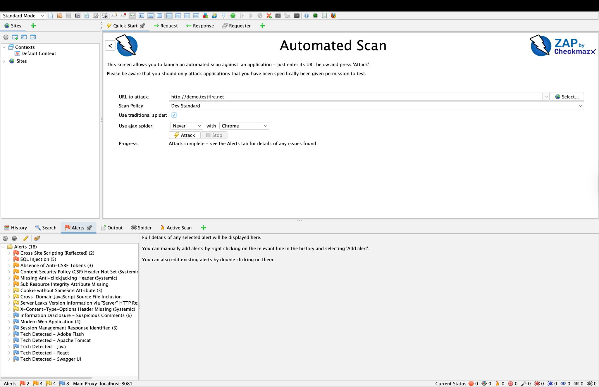
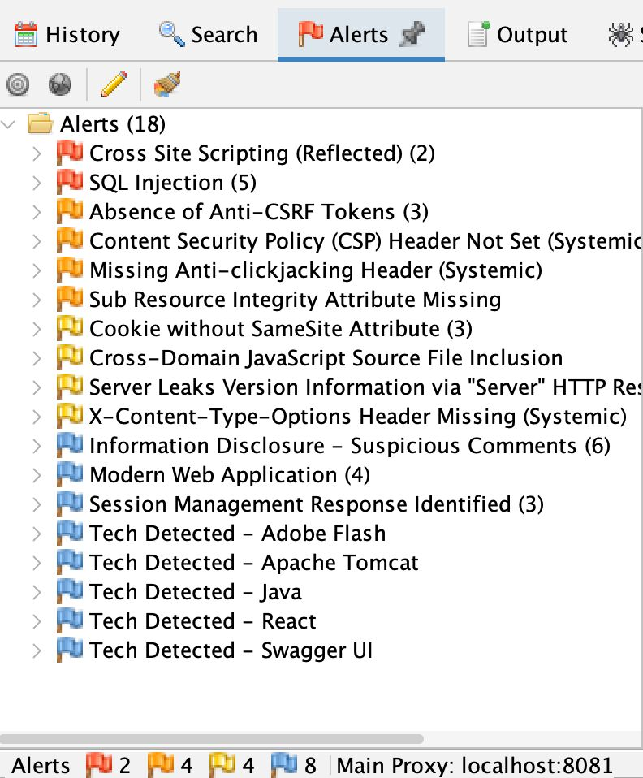
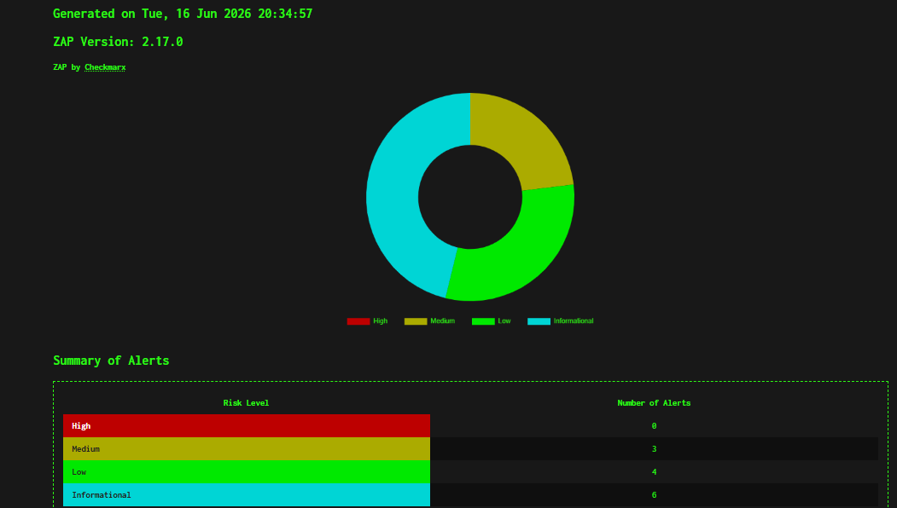

# 🛡️ Security Testing with OWASP ZAP

> Security is most effective when it becomes part of the engineering process, not an afterthought.
 My approach combines functional testing with vulnerability assessment to help identify security risks before production deployment.

---

# Overview

In addition to functional and automation testing, I perform baseline security assessments using OWASP ZAP to identify common web application vulnerabilities.

My goal is to identify common security weaknesses early in the software delivery lifecycle, enabling engineering teams to remediate issues before production. While this does not replace a dedicated penetration test, it complements functional testing by integrating baseline application security checks into the QA process.

---

## Security Validation Coverage

Typical assessments include:

- Passive Scanning
- Active Scanning
- Authentication Testing
- Session Management
- Cookie Security
- HTTP Header Validation
- SSL/TLS Verification
- Input Validation
- Injection Testing
- Cross-Site Scripting (XSS)
- Cross-Site Request Forgery (CSRF)
- Security Misconfiguration
- Information Disclosure

---

# Tools

| Tool | Purpose |
|------|---------|
| OWASP ZAP | Security Assessment |
| Browser Proxy | Request Interception |
| Swagger/OpenAPI | Endpoint Discovery |
| Postman | API Validation |
| SQL | Backend Verification |

---

# Typical Workflow

```text
Target Application
        │
        ▼
Spider / Crawl
        │
        ▼
Passive Scan
        │
        ▼
Active Scan
        │
        ▼
Vulnerability Analysis
        │
        ▼
Risk Classification
        │
        ▼
Security Report
        │
        ▼
Developer Remediation
```

---

# Vulnerabilities Assessed

### Input Validation
- Cross-Site Scripting (XSS)
- SQL Injection
- Cross-Site Request Forgery (CSRF)

### Authentication & Session Security
- Authentication Weaknesses
- Session Management
- Cookie Security

### Configuration & Infrastructure
- Missing Security Headers
- Insecure HTTP Methods
- Mixed Content
- Information Disclosure
- Directory Browsing

---

# Risk Classification

- High
- Medium
- Low
- Informational

---

# Deliverables

Typical deliverables include:

- HTML Security Assessment Reports
- Vulnerability Summaries
- Risk Classification
- Evidence Screenshots
- Remediation Recommendations
- Security Validation Results

---

# Business Impact

Integrating baseline security testing into the QA process helped teams:

- Identify common vulnerabilities earlier in the development lifecycle
- Improve release confidence through security validation
- Reduce the risk of deploying known security issues
- Support secure development practices
- Provide developers with actionable remediation guidance
- Encourage security awareness across engineering teams

---

# Screenshots

### 📸 Automated Spider Mapping



This assessment demonstrates how OWASP ZAP automatically maps an application's attack surface by discovering pages, technologies, and API endpoints before active security testing begins.

[:fontawesome-brands-linkedin: Read the full LinkedIn article](https://www.linkedin.com/posts/michaeljndueso_softwaretesting-appsec-api-activity-7467699025568223233-DimF?utm_source=social_share_send&utm_medium=member_desktop_web&rcm=ACoAAC0KOAMB4JNjVL1I3Cfum1yHcU8dfCVfy80){ .md-button .md-button--primary }

### 📸 Vulnerability Assessment



This scan highlights how vulnerabilities are prioritized using OWASP ZAP's Alerts dashboard, helping teams focus on the most critical security issues first.

[:fontawesome-brands-linkedin: Read the full LinkedIn article](https://www.linkedin.com/posts/michaeljndueso_websecurity-applicationsecurity-softwarequality-activity-7467832668865409024-IYpf?utm_source=social_share_send&utm_medium=member_desktop_web&rcm=ACoAAC0KOAMB4JNjVL1I3Cfum1yHcU8dfCVfy80){ .md-button .md-button--primary }


## 📄 Sample Security Assessment Report

The report below demonstrates the type of HTML vulnerability assessment generated after an automated OWASP ZAP scan. It summarizes discovered issues, their severity, affected endpoints, and recommended remediation steps.

{ loading=lazy }

> Sensitive project information has been removed for confidentiality.

{ .md-button .md-button--primary }


<!-- 📥 **Preview Sample PDF Report** -->

<!-- <iframe
    src="../assets/files/zap_report.pdf"
    width="100%"
    height="800px"
    style="border: 1px solid #ddd; border-radius: 8px;">
</iframe>

[:material-download: Download Resume (PDF)](../assets/files/zap_report.pdf){ .md-button .md-button--primary } -->

<!-- [:material-download: Download Resume (PDF)](../assets/files/Michael_Jackson_Ndueso_Resume.pdf){ .md-button .md-button--primary } -->
---

# Skills Demonstrated

- OWASP Top 10
- Vulnerability Assessment
- Web Security Testing
- Risk Analysis
- Security Reporting
- Secure SDLC

---

# Lessons Learned

Security testing reinforced that software quality extends beyond functionality. By incorporating baseline security validation into regular QA activities, teams can detect common vulnerabilities earlier, reduce remediation costs, and build more secure applications without disrupting development workflows.

